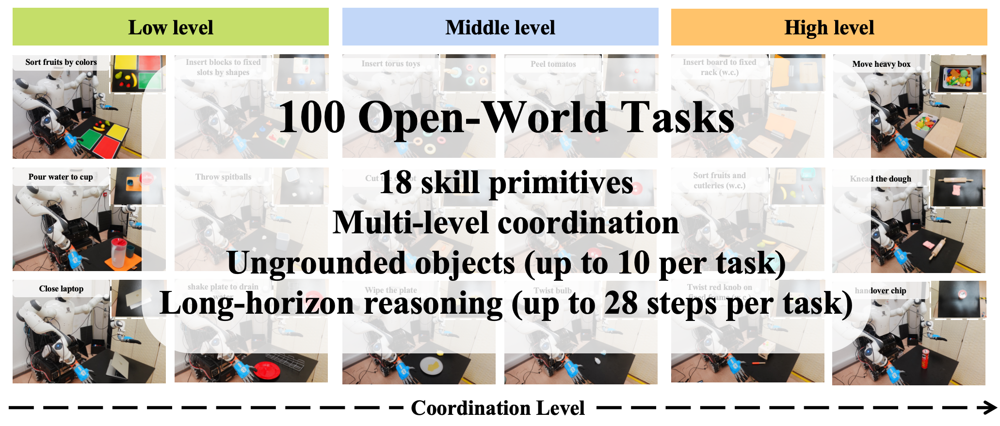
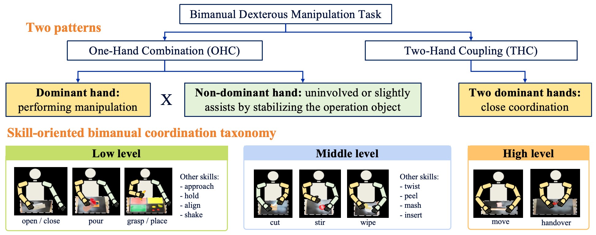
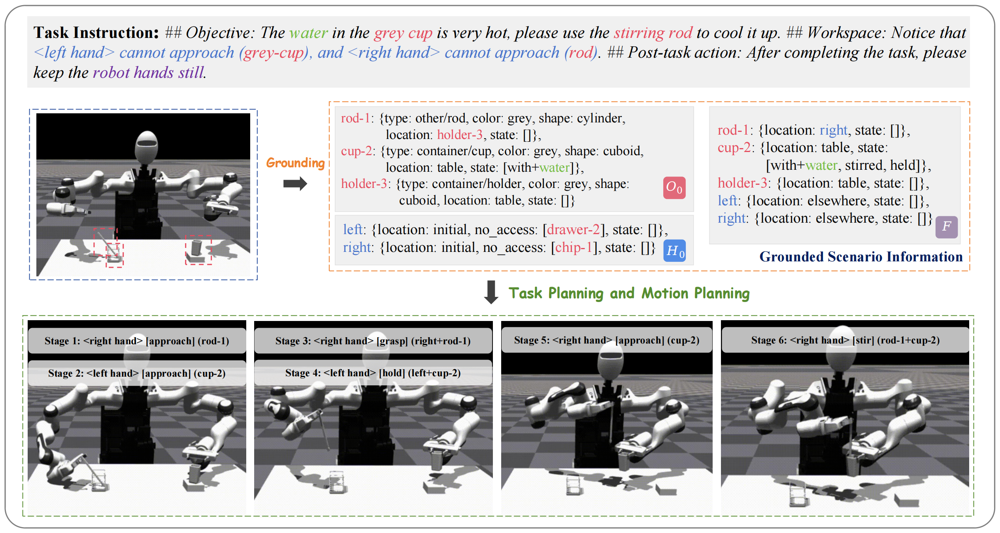

# Open-World Task Planning for Humanoid Bimanual Dexterous Manipulation via Vision-Language Models

### [Paper (comming soon)]() | [Video (comming soon)]()

> Open-World Task Planning for Humanoid Bimanual Dexterous Manipulation via Vision-Language Models <br />
> Author: Zixin Tang, Zhihao Li, Zhuo Li, Fei Chen

## Abstract
Open-world task planning, characterized by handling unstructured and dynamic environments, has been increasingly explored to integrate with long-horizon robotic manipulation tasks. However, existing evaluations of the capabilities of these planners primarily focus on single-arm systems in structured scenarios with limited skill primitives, which is insufficient for numerous bimanual dexterous manipulation scenarios prevalent in the real world. To this end, we introduce OBiMan-Bench, a large-scale benchmark designed to rigorously evaluate open-world planning capabilities in bimanual dexterous manipulation, including task-scenario grounding, workspace constraint handling, and long-horizon cooperative reasoning. In addition, we propose OBiMan-Planner, a vision-language model-based zero-shot planning framework tailored for bimanual dexterous manipulation. OBiMan-Planner comprises two key components, the scenario grounding module for grounding open-world task instruction with specific scenarios and the task planning module for generating sequential stages. Extensive experiments on OBiMan-Bench demonstrate the effectiveness of our method in addressing complex bimanual dexterous manipulation tasks in open-world scenarios.

## Motivations
Previous works primarily focus on:
+ Single arm systems
+ Structured scenario
+ Limited skill primitives

In this work, we propose a large-scale benchmark named OBiMan-Bench and a zero-shot VLM-based task planner named OBiMan-Planner for open-world task planning for bimanual dexterous manipulation.


## OBiMan-Bench
We create a large-scale benchmark named OBiMan-Bench to evaluate open-world planning performance for bimanual dexterous manipulation.

 

OBiMan-Bench defines **100** open-world tasks for evaluating long-horizon bimanual cooperative reasoning, with a breakdown of $31$ low-level tasks, 38 middle-level tasks, and 31 high-level tasks. The varying task complexities, from low-level to high-level coordination, ensure a comprehensive assessment of open-world planning ability to handle long-horizon, ungrounded-object, multi-skill interactions for bimanual dexterous manipulation. 

In total, we consider **18** skill primitives commonly used in human bimanual household activities. These skills include *move, handover, approach, hold, align, grasp, place, open, close, shake, stir, peel, pour, cut, twist, mash, insert and wipe*.


### Download
[OBiMan-Bench (comming soon)]()

### Skill-oriented bimanual coordination 
We simplify manipulation tasks into two patterns and develop a skill-oriented bimanual coordination taxonomy.

 

+ Two patterns

    + Two-Hand Coupling (THC): both hands are
required to perform a skill. For example, handover transfers
an object between hands, and move focuses on fixed-offset
synchronous movements like carrying a box or kneading
dough.

    + One-Hand Combination (OHC):  functionally differentiates the dominant hand performing manipulation from the non-dominant hand, which either remains uninvolved or slightly assists by stabilizing the operation object.
+ Three coordination levels

    + High-level: Skills are in the THC pattern, including
*move and handover*, which require highly dynamic
coordination of hands.

    + Middle-level: Skills are in the OHC pattern, and the
non-dominated hand is required to assist hold the object
for stabilization. We define skills, including *insert, cut, peel, stir, twist, mash, and wipe*, as belonging to this
level when applying to unfixed objects.


### Pipeline of solving open-world planning tasks in the TAMP framework
Task and Motion Planning (TAMP) framework has been widely used in manipulation skill learning approaches to reduce the difficulties in handling long-horizon tasks by leveraging task planners to decompose complex tasks into sequential stages. 

 

## OBiMan-Planner
To address bimanual dexterous tasks in open-world scenarios defined in OBiMan-Bench, we propose OBiMan-Planner, a novel zero-shot planning framework based on vision-language models (VLM).

Our approach includes two key components: 
+ A hierarchical grounding module is designed to bridge open-world tasks with specific scenario images. Specifically, the VLM layer employs a VLM within a feedback validation loop to extract task-relevant objects and infer their properties, followed by the rule layer to ground constraints and objectives. 
+ A fully VLM-based task planning module is introduced to generate task plans based on grounded scenario information. We integrate a rule-based skill world model into the validation process, which encapsulates all knowledge about the effect of all skills. This model-based validation helps assess the feasibility of the proposed plan, providing critical feedback to the VLM.


### Installation of OBiMan-Planner
1. Clone the repo:
```bash
git clone https://github.com/Zixin-Tang/OBiMan.git
```


2. Create a conda environment:
```bash
conda create env -n obiman python==3.10
```


3. Install dependencies:
```bash
pip install -r requirments.txt
```

### Run OBiMan-Planner and its variants

1. Set the OPENAI_API_KEY in your bashrc or zshrc.
```bash
export OPENAI_API_KEY="your_openai_key"
```
2. Download the dataset from the above link and put it into the path `exp/`. Make sure your folder is as follows: 

```
- OBiMan
    - exp
        - OBiman-Bench
    - figs
    - prompts
    - ...
```
3. Activate the conda environment and download the dataset. 
```bash
cd OBiMan
conda activate obiman
```
4. Run OBiMan-Planner or its variant. For example:
```bash
python task_planner.py
```
5. The experiment results will be saved to the corresponding task folder in `exp/OBiMan-Bench/....`


